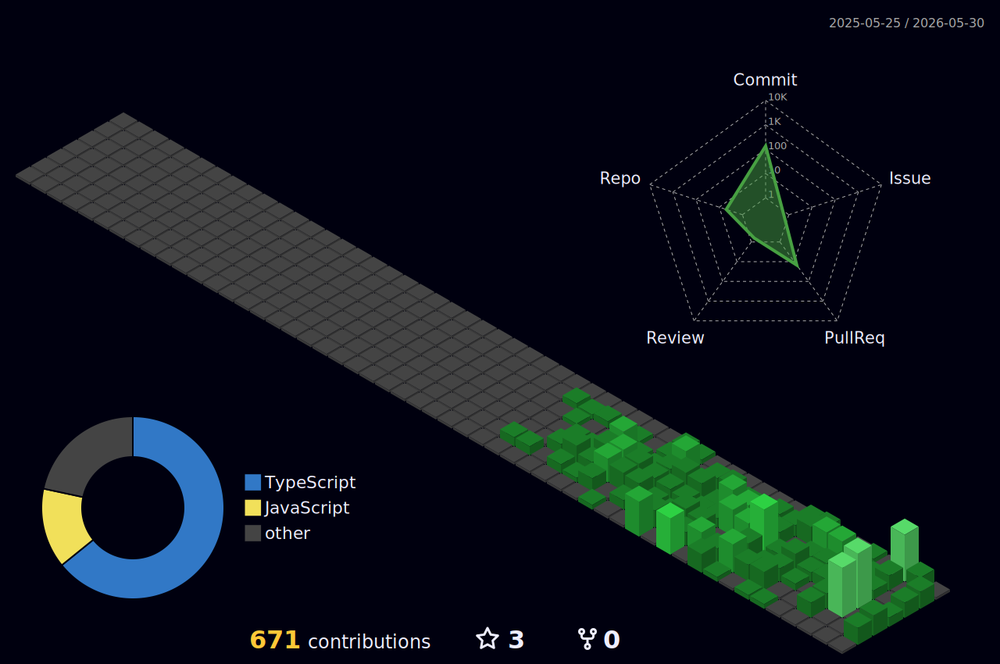

<div align="center">


<br/>



<br/>

<picture>
  <source media="(prefers-color-scheme: dark)" srcset="https://raw.githubusercontent.com/harshranjan-art/harshranjan-art/output/github-contribution-grid-snake-dark.svg" />
  <source media="(prefers-color-scheme: light)" srcset="https://raw.githubusercontent.com/harshranjan-art/harshranjan-art/output/github-contribution-grid-snake.svg" />
  
</picture>

<br/>

[](https://linkedin.com/in/harshranjan-art)&nbsp;
[](https://harshranjan.vercel.app)&nbsp;
[](mailto:harshranjan3648@gmail.com)&nbsp;


<br/>


&nbsp;&nbsp;


</div>

---

CS undergrad shipping **production agentic systems** — DeFi execution engine on GCP, MCP-based infra agents, LLM eval pipelines. Full stack from multi-agent architecture down to gRPC APIs serving 10M+ users.

- **Full Stack Developer @ [Stable Money](https://stablemoney.in)** · Dec 2025 – Present (PPO)
- **B.Tech CS · Punjab Engineering College** · CGPA 8.01 · 2023–2027
- **National Winner** · American Express Campus Challenge 2025 — GenAI Product Strategy
- **National Finalist** · Smart India Hackathon 2024 — Top 1%, 516K+ participants
- **Amazon ML Summer School 2025** · Top 5% Nationally — Generative AI Track
- Bengaluru, India

---

## Experience

**Stable Money · Full Stack Developer** — Dec 2025 – Present
> High-ownership startup · PPO from internship

- Built an MCP-based ReAct on-call infra agent integrated with Grafana, Jenkins, Metabase & GitHub — **80% reduction in manual triage time**, 92% accuracy, 40% MTTD improvement
- Designed event-driven pipelines (GCP Pub/Sub), Redis caching (P95 latency 5×), 30+ REST/gRPC APIs (Java, Spring Boot) — **10M+ users**, 90+ PRs in 4 months

---

## Projects

**[DeFAI — Autonomous DeFi Agent](https://github.com/harshranjan-art/DEFAI-MCP)**
TypeScript · Gemini 3.1 Pro/Flash-Lite · Langfuse · Vertex AI · Cloud Run

- Gemini Pro (planner) → Flash-Lite (verifier); three-layer injection defense rejected ~12% malformed trade calls — **zero adversarial bypasses**
- 25 golden trajectories via LLM-as-judge; merges blocked below 90% pass-rate; Flash-Lite/Pro tiered routing cut per-turn tokens **~60%**
- Cloud Run + Vertex Vector Search; 16 MCP tools; five-layer write defense → OWASP LLM Top-10

**GenAI Call Agent — Appointment Automation**
Python · Twilio · Groq · Conversation State Machine

- Production FSM handling rescheduling, cancellations, ambiguous inputs
- **91% booking success rate** across 300+ test calls; avg session 4.5 min → **90 sec**

---

## Achievements

| | |
|---|---|
| 🥇 National Winner | American Express Campus Challenge 2025 — ranked 1st nationally |
| 🥈 National Finalist | Smart India Hackathon 2024 — AI Fraud Detection, Top 1%, 516K+ |
| 🤖 Amazon ML Summer School | Top 5% Nationally — Generative AI Track (2025) |
| 🚀 Runner-Up | Hack2Hatch × SeedLink 2025 — 2nd / 250+ teams |
| 💻 LeetCode | 500+ problems (25% Hard) · JEE Mains 99th Percentile |

---

## Stack

```
Languages    Python · TypeScript · Java · C++ · SQL
AI / Agents  Gemini · LangChain · LangGraph · RAG · MCP · ReAct · LLM-as-Judge
Cloud        GCP (Vertex AI, Cloud Run, Pub/Sub) · AWS (EC2, S3, SQS)
Backend      Spring Boot · gRPC · REST · Redis · PostgreSQL · MongoDB
DevOps       Docker · Kubernetes · GitHub Actions · Jenkins · Grafana · Kafka
Security     OWASP LLM Top-10 · Prompt Injection Defense · OAuth · JWT
```

---

*Open to opportunities — harshranjan3648@gmail.com*
